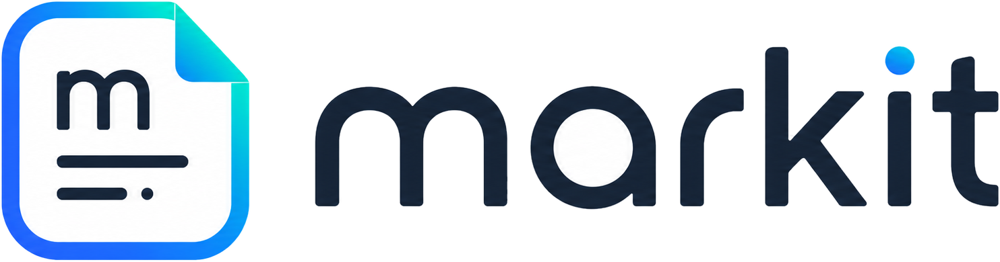
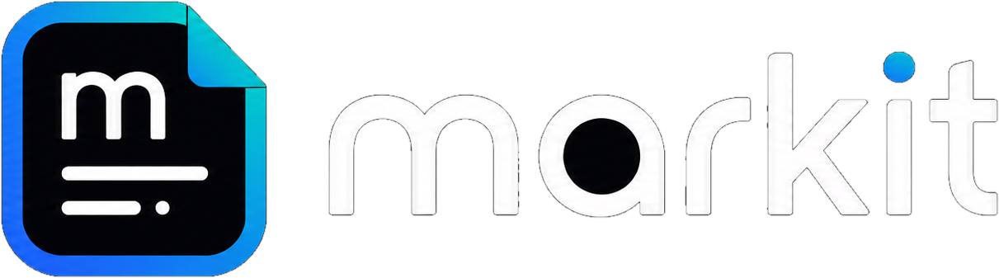

# markit



**markit** es un lector open source de archivos Markdown para Windows. Esta pensado para abrir documentos `.md` con formato, zoom, busqueda, resaltado, modo claro/oscuro y pantalla completa, sin depender de Visual Studio Code, extensiones, navegadores ni herramientas pesadas.

La idea es simple: leer Markdown con una experiencia comoda, parecida a un lector PDF liviano o a un apunte digital, pero conservando la ventaja de que el archivo sigue siendo texto plano.

## Instalacion y uso

### Compatibilidad actual

| Sistema | Estado | Nota |
|---|---|---|
| Windows x64 | Soportado en `v0.1.0` | Version actual basada en WPF y .NET 8 |
| Linux | En preparacion | Base compartida iniciada en `Markit.Core`; no hay instalador Linux todavia |
| macOS | No planificado | Podria evaluarse luego de resolver multiplataforma |

La primera linea base de Markit esta enfocada en Windows porque WPF es una tecnologia especifica de Windows. La instalacion en Linux queda marcada como evolucion futura y requiere evaluar una base multiplataforma o una variante de interfaz compatible.

### Instalar en Windows

El instalador se genera como ejecutable single-file para Windows x64.

Flujo esperado:

1. Compilar y publicar la app.
2. Copiar el ejecutable publicado como `MarkitInstaller.exe`.
3. Ejecutar el instalador.
4. Elegir la carpeta de instalacion o aceptar la ubicacion por defecto.
5. Asociar archivos Markdown con Markit para el usuario actual.

Ubicacion por defecto:

```text
%LocalAppData%/Markit/Markit.exe
```

Comandos soportados:

```powershell
.\Markit.exe --install
.\Markit.exe --uninstall
```

### Uso basico

1. Abrir Markit.
2. Seleccionar un archivo `.md`, `.markdown`, `.mdown` o `.txt`.
3. Leer el documento con formato visual.
4. Ajustar el zoom segun la pantalla.
5. Usar busqueda para encontrar contenido.
6. Resaltar fragmentos importantes como si fuera un apunte.
7. Guardar el Markdown si se quieren conservar los resaltados.

Markit esta pensado principalmente para visualizar y estudiar documentos Markdown. La edicion existe como apoyo para guardar resaltados o cambios puntuales, pero el foco del proyecto no es reemplazar un editor de texto ni un IDE.

### Instalacion en Linux

Linux esta definido como proxima evolucion del proyecto, no como funcionalidad disponible en `v0.1.0`.

Para soportar Linux se evaluaran alternativas que permitan conservar el proposito de Markit:

- lector simple de Markdown;
- instalacion local;
- experiencia comoda de lectura;
- resaltadores para estudio;
- soporte claro/oscuro;
- base tecnica mantenible.

Posibles caminos tecnicos:

- separar el motor de lectura/renderizado Markdown de la interfaz WPF;
- evaluar una UI multiplataforma de escritorio;
- generar paquetes instalables para distribuciones Linux cuando exista una base compatible.

Ver el plan tecnico en [docs/linux-port.md](docs/linux-port.md).

### Compilar desde codigo

Requisitos:

- Windows
- .NET 8 SDK

Build de validacion:

```powershell
dotnet build .\ReadmeReader\ReadmeReader.csproj -c Release --no-restore
```

Publicacion single-file:

```powershell
dotnet publish .\ReadmeReader\ReadmeReader.csproj -c Release -r win-x64 --self-contained true -p:PublishSingleFile=true -p:EnableCompressionInSingleFile=true
```

Salida publicada:

```text
ReadmeReader/bin/Release/net8.0-windows/win-x64/publish/ReadmeReader.exe
```

## Por que nace

Markit nace de una necesidad cotidiana: abrir un README, una nota tecnica, una guia de estudio o documentacion de proyecto sin tener que cargar un editor completo.

Los archivos Markdown son rapidos de procesar porque son texto plano. Eso los vuelve ideales para documentacion, apuntes, guias tecnicas y material de estudio. El problema aparece al momento de leerlos: muchas herramientas estan pensadas para editar codigo, funcionan online o viven dentro de un IDE, donde se pierde el proposito de abrir el archivo de forma simple y concentrarse solamente en el contenido.

Markit busca cubrir ese espacio: un visualizador de Markdown para leer comodamente como si fuera un libro o un apunte, con zoom, pantalla completa y resaltadores para estudiar. Aunque permite guardar cambios necesarios, como los resaltados, su foco principal no es modificar el documento sino visualizarlo, recorrerlo y marcar lo importante sin romper el flujo de lectura.

## Autor

Creado por **Exequiel Carranza**.

Developer y estudiante de **Ingenieria en Sistemas de Informacion en la UTN**.

## Open source

Markit se publica como herramienta open source para que cualquier persona pueda estudiar el codigo, adaptarlo, mejorarlo o usarlo como base para otras aplicaciones de escritorio en Windows.

El proyecto prioriza:

- simplicidad;
- legibilidad;
- accesibilidad;
- evolucion incremental;
- integracion nativa con Windows;
- una base tecnica clara para seguir creciendo.

## Estado del proyecto

Version actual: **v0.1.0**

Esta primera version marca la linea base del proyecto: una aplicacion de escritorio funcional para Windows, construida con WPF y .NET 8, orientada a visualizar archivos Markdown de forma comoda.

El objetivo de esta etapa no es cubrir todos los escenarios posibles, sino dejar una base usable, simple y evolucionable para seguir mejorando la experiencia de lectura.

## Funcionalidades

- Apertura de archivos `.md`, `.markdown`, `.mdown` y `.txt`.
- Apertura desde dialogo nativo de Windows.
- Drag & drop de archivos.
- Apertura por argumento de consola o asociacion de archivo.
- Renderizado visual de Markdown:
  - titulos;
  - parrafos;
  - listas ordenadas y no ordenadas;
  - tablas;
  - citas;
  - bloques de codigo;
  - codigo inline;
  - enlaces;
  - imagenes locales;
  - resaltados HTML `<mark>`.
- Zoom de lectura entre `50%` y `300%`.
- Cambio de zoom con botones, selector, `Ctrl + rueda` y `Ctrl + 0`.
- Ancho de lectura adaptativo segun el tamano de ventana o pantalla.
- Contenido centrado para lectura prolongada.
- Scroll suavizado con rueda de mouse.
- Modo claro y oscuro.
- Logo adaptado al tema.
- Pantalla completa para modo lectura.
- Barra flotante de resaltado en pantalla completa.
- Busqueda con resaltado de coincidencias.
- Navegacion entre coincidencias.
- Resaltado de texto en colores pastel.
- Goma para quitar resaltados.
- Guardado del Markdown modificado.
- Guardar como.
- Impresion desde dialogo nativo.
- Archivos recientes.
- Persistencia de preferencias:
  - tema;
  - zoom;
  - tamano de ventana;
  - archivos recientes.
- Instalador local para Windows.
- Reemplazo de version anterior al reinstalar.
- Asociacion de archivos Markdown sin permisos de administrador.
- Integracion con Windows mediante App Paths.
- Soporte DPI PerMonitorV2.
- Manejo global de errores inesperados.

## Atajos

| Atajo | Accion |
|---|---|
| `Ctrl + O` | Abrir Markdown |
| `Ctrl + S` | Guardar |
| `Ctrl + Shift + S` | Guardar como |
| `Ctrl + F` | Enfocar busqueda |
| `F3` | Siguiente coincidencia |
| `Shift + F3` | Coincidencia anterior |
| `Ctrl + +` | Acercar zoom |
| `Ctrl + -` | Alejar zoom |
| `Ctrl + rueda` | Cambiar zoom |
| `Ctrl + 0` | Restablecer zoom |
| `Ctrl + D` | Alternar modo claro/oscuro |
| `Ctrl + H` | Activar resaltador |
| `Ctrl + Shift + H` | Activar goma |
| `F11` | Pantalla completa |
| `Esc` | Salir de herramienta activa o pantalla completa |

## Tecnologias

- **Lenguaje:** C#
- **Runtime:** .NET 8
- **Framework de escritorio:** WPF
- **Target:** `net8.0-windows`
- **UI:** XAML + code-behind incremental
- **Renderizado:** `FlowDocument` / `FlowDocumentScrollViewer`
- **Empaquetado:** single-file self-contained para `win-x64`
- **Instalacion:** copia local en `%LocalAppData%`
- **Asociacion de archivos:** registro por usuario en `HKCU\Software\Classes`
- **DPI:** manifest con `PerMonitorV2`
- **Privacidad:** sin telemetria
- **Dependencias externas:** sin paquetes NuGet adicionales

## Arquitectura

Markit mantiene una arquitectura deliberadamente simple para una aplicacion de escritorio chica.

```text
Markit.slnx
Markit.Core/
  Markit.Core.csproj
  DocumentFileService.cs
ReadmeReader/
  App.xaml
  App.xaml.cs
  MainWindow.xaml
  MainWindow.xaml.cs
  InstallerWindow.xaml
  InstallerWindow.xaml.cs
  MarkdownDocumentRenderer.cs
  UserSettings.cs
  AppInstaller.cs
  app.manifest
  Assets/
```

| Archivo | Responsabilidad |
|---|---|
| `Markit.Core/DocumentFileService.cs` | Logica compartida de archivos, extensiones soportadas, lectura/escritura y errores |
| `App.xaml.cs` | Arranque de la aplicacion, modo instalador/desinstalador y apertura por argumento |
| `MainWindow.xaml` | Estructura visual, toolbar, lector, controles y accesibilidad basica |
| `MainWindow.xaml.cs` | Coordinacion de UI, comandos, busqueda, resaltado, tema, pantalla completa y estado visual |
| `InstallerWindow.xaml` | Experiencia visual del instalador |
| `InstallerWindow.xaml.cs` | Flujo de instalacion, progreso y seleccion de carpeta |
| `MarkdownDocumentRenderer.cs` | Conversion de Markdown a `FlowDocument` |
| `UserSettings.cs` | Persistencia local de preferencias y recientes |
| `AppInstaller.cs` | Instalacion local y asociacion de archivos Markdown |
| `app.manifest` | Declaracion DPI PerMonitorV2 para Windows |

## Persistencia local

Las preferencias del usuario se guardan en:

```text
%LocalAppData%/Markit/settings.json
```

Se guarda:

- modo claro/oscuro;
- zoom;
- tamano de ventana;
- archivos recientes.

Si la configuracion no puede leerse o guardarse, la aplicacion sigue funcionando.

## Resaltado

Los resaltados se guardan directamente en el Markdown como HTML compatible:

```html
<mark style="background-color: #FFF3A3;">texto resaltado</mark>
```

Esto permite conservar el resaltado sin crear una base de datos adicional ni archivos paralelos.

## Assets

```text
ReadmeReader/Assets/
  markit.ico
  markit-logo-horizontal-light.png
  markit-logo-horizontal-dark.png
```

Logo para fondos oscuros:



## Roadmap posible

- Version instalable para Linux.
- Evaluacion de una base multiplataforma para escritorio.
- Separacion progresiva entre motor de renderizado Markdown y capa visual.
- Migracion gradual de logica compartida hacia `Markit.Core`.
- Mejoras de renderizado Markdown.
- Soporte para mas sintaxis de Markdown.
- Exportacion a PDF.
- Instalador firmado.
- Publicacion de releases en GitHub.
- Mejoras de accesibilidad avanzada.
- Tests automatizados del renderizador.

## Licencia

Este proyecto se distribuye bajo licencia MIT. Ver [LICENSE.md](LICENSE.md).
